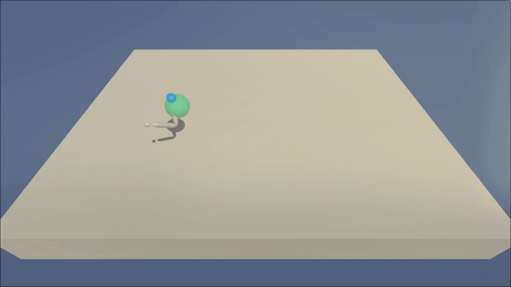

# Project 2: 
This is my solution for Project 2 - Continuous Control of Udacity's Deep Reinforcement Learning nanodegree.

### Project Description
The goal is to control a double-jointed robtic arm so that its 'hand' is in constant contact with a moving target zone. For every frame that the arm touches the target zone, a reward of 0.1 is given.\
As input, the arm accepts 4 values between -1 and 1 where each value represents the amount of torque that should be applied to one of its four joints. The obervation space consists of 33 variables that describe the current position, rotation, velocity and angular velocity of the arm. 

### Setup
The setup for this repo is almost identical to https://github.com/udacity/deep-reinforcement-learning#dependencies so make sure to follow the installation instructions there.  \
If you wish to run with one of the pretrained models from the checkpoint folder, torch must be upgraded to a newer version:
``` bash
pip3 install --upgrade torch
```

Furthermore, there is a Dockerfile in this repo with which it is possible to utilize AMD GPUs for training. To use it, make sure docker is installed, then simply execute the `startDocker.sh` script. This will download and start the image.

### Training
In order to train the model, adjust the hyperparameters in `agent.py` to your liking, then simply execute
```
python3 train.py
```

### Testing
To test your trained models, you can execute `test.py`. The script expects the folder in which the model files a stored as input. Eg:
``` bash
python3 test.py checkpoint
```

### Implementation Details
I solved the problem using the Deep Deterministic Policy Gradients (DDPG) algorithm.
See the [report](REPORT.md) for a detailed description of the implementation and design choices.

### Artifacts
Trained models are stored in the checkpoints folder, together with an image of their training progress as seen below.


