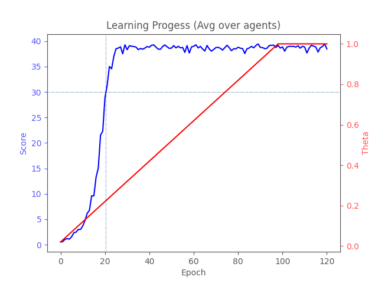

# Project Report

## Implementation Details
### agent.py
This file implements the DDGP Agent. DDGP is a actor-critic reinforcement learning algorithm. In a nutshell, the critic tries to constantly estimate the achievable reward based on the current state, while the actor tries to find a policy that makes the critic predict the highest scores.

The agent class holds the Actor and Critic models and implements functions for choosing an action for a given state, training the actor and critic models as well as loading and saving checkpoints. \
For the size of the replay buffer, batch size, learning rates and the soft-update ratio tau common default values were chosen with 100k, 256, 0.0001 and 0.01, respectively. \
At 0.9, the reward discount value gamma was set to a relitively small value because the task is rather static with a constant flow of rewards that does not rely on extensive setup.\

### memory.py
The ReplayBuffer class is defined in this file. It is little more than a larger FiFo buffer that can be sampled for past experiences.

### noise.py
This file implements the OUNoise class. During training, this noise is added to the chosen action to ensure a good expoloration of the state space and to not get trapped in a local minimum immediately.

The [Ornstein-Uhlenbeck process](https://en.wikipedia.org/wiki/Ornstein%E2%80%93Uhlenbeck_process) is used to generate noise that is controllably decaying over the course of the training. \
There are three parameters that describe the process:
* `mu`: This is the expected mean value
* `sigma`: The standard deviation
* `theta`: How fast the process reverts to mu

At the beginning of the training, we start off with a very low theta to allow high noise values for longer to boost expoloration. Over the course of one epoch, the amount of noise then reduces gradually due to the mean-reverting property of the OU-Process. \
After each epoch, the process is resetted and theta is increased by `theta_incr` until it eventually reaches a value of one. At this point the amount of noise is only given by `mu` and `sigma`.

The graphic below shows the trajectory of the OU-Process for different theta values. Note that the starting point for each trajectory is chosen randomly between -1 and 1.

### model.py
Actor and Critic models are defined in this file. \
The actor is a simple 2-layer network with 256 and 128 hidden nodes. \
The critic is a 2-layer network where the actor's output is fed directly into the first hidden layer. The layers have 260 (256 + 4 actions) and 128 nodes, respectively.\
Both models use the ReLU activation function exclusively.

### utils.py
Utility functions are defined in this file. Currently there is only one:
* `plot_learning_curve`: takes a list of scores, a list of theta values, an output path and a title and creates the progress like this one:

### train.py
This is the entrypoint for training a model. It does not require any arguments and will simply train a model until the average score over all agents stayed above 30 for at least 100 episodes.
(Technically, the requirement for passing this project only asks for the average score over 100 episodes to be over 30, but since this version is even stricter, I didn't bother running it again.)

### test.py
This is the entrypoint for testing a trained model. It takes the path to the checkpoint folder as argument and will run the single-agent environment for 10 episodes. The achieved score is printed to the terminal after each episode.

## Potential Improvements
I did not try to optimize pretty much any of the hyperparameters so there might be still room for improvement.

